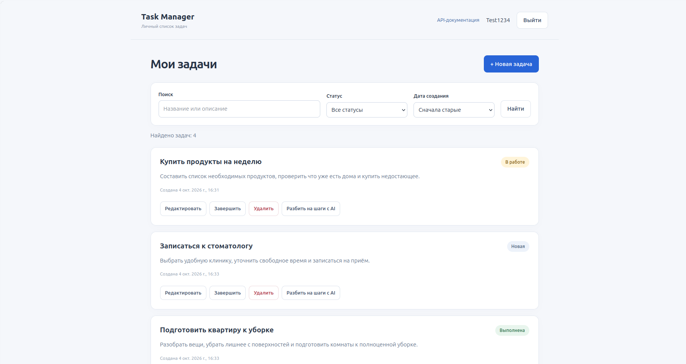
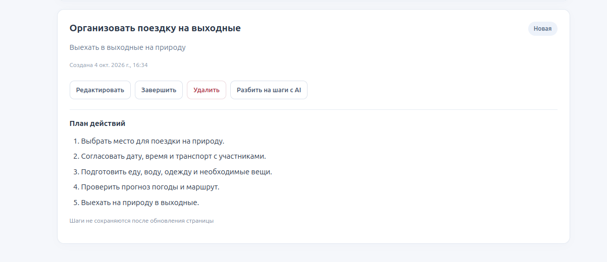

# Task Manager

A learning portfolio project for personal task management: a Django REST Framework backend, a browser interface, and an OpenAI integration that breaks a task into steps.

- [Live application](https://89-125-168-111.sslip.io/app/)
- [API documentation](https://89-125-168-111.sslip.io/api/docs/)

Register an account, sign in, and create a task to try the interface.

## Screenshots

Task list with search, status filters, and task actions:



AI-generated steps displayed below a task:



## Features

- Russian-language browser interface built with Django templates, CSS, and vanilla JavaScript.
- Registration, JWT login, and logout in the browser.
- AI task breakdown into 3–5 steps; results are temporary and are not stored in the database.

- Create, retrieve, update, and delete tasks.
- Task statuses: `new`, `in_progress`, and `done`.
- Mark a task as completed through a dedicated endpoint.
- Access restricted to the authenticated user's tasks.
- Filter tasks by status.
- Search task titles and descriptions.
- Sort tasks by status or creation time.
- Paginate task lists with five items per page.
- Update username, email, password, and profile avatar through the API.
- Delete the current account through the API.
- OpenAPI schema and Swagger UI.

## Tech Stack

| Component | Technology |
|---|---|
| Runtime | Python 3.14 |
| Framework | Django 6.0.6 |
| REST API | Django REST Framework 3.17.1 |
| Authentication | SimpleJWT |
| Filtering | django-filter |
| Frontend | Django templates, CSS, vanilla JavaScript / fetch |
| AI integration | OpenAI Python SDK, structured responses validated with Pydantic |
| API documentation | drf-spectacular |
| Database | PostgreSQL 18 |
| Database driver | psycopg 3 |
| Image handling | Pillow |
| Application server | Gunicorn |
| Reverse proxy | Nginx |
| Containers | Docker and Docker Compose |
| TLS certificates | Let's Encrypt / Certbot |

Python dependencies are pinned in `requirements.txt`.

## Architecture

The project is a Django monolith with one application:

```text
task_manager/
    settings.py          Django configuration
    urls.py              Root URL configuration
    wsgi.py              Gunicorn entry point
    asgi.py              ASGI entry point
main/
    models.py            Task and Profile models
    serializers.py       Request validation and response serialization
    api_views.py         Task viewset and account endpoints
    permissions.py       Task ownership permission
    urls.py              API routes and documentation
    tests.py             API tests
    migrations/          Database migrations
    services/ai.py       OpenAI integration and response validation
    templates/main/app.html  Browser interface
    static/main/         Interface CSS and JavaScript
Dockerfile
compose.yaml
nginx/default.conf
```

The data model uses Django's built-in `User`:

- A user has multiple tasks through `Task.owner`.
- A user has a profile through `Profile.user`.
- A profile stores an optional avatar.
- Deleting a user cascades to their task and profile records.

Tasks are exposed through a `ModelViewSet`. Registration and current-account operations use generic API views.

Task queries are restricted to the current user. The server assigns task ownership on creation; the client cannot choose another owner. Requests for another user's task return `404`.

The browser interface is served at `/app/` on the same origin as the API. It uses JWT tokens stored in `sessionStorage`. The AI integration is isolated in `main/services/ai.py`; the API key stays on the server.

## API Endpoints

| Method | Endpoint | Description | Authentication |
|---|---|---|---|
| POST | `/api/register/` | Register a user and create a profile | Public |
| POST | `/api/token/` | Obtain access and refresh tokens | Public |
| POST | `/api/token/refresh/` | Obtain an access token using a refresh token | Refresh token |
| GET | `/api/tasks/` | List the current user's tasks | JWT |
| POST | `/api/tasks/` | Create a task | JWT |
| GET | `/api/tasks/{id}/` | Retrieve a task | JWT |
| PUT, PATCH | `/api/tasks/{id}/` | Update a task | JWT |
| DELETE | `/api/tasks/{id}/` | Delete a task | JWT |
| POST | `/api/tasks/{id}/complete/` | Set task status to `done` | JWT |
| POST | `/api/tasks/{id}/ai-breakdown/` | Generate temporary task steps | JWT |
| GET | `/api/me/` | Retrieve the current account | JWT |
| PUT, PATCH | `/api/me/` | Update the current account | JWT |
| DELETE | `/api/me/` | Delete the current account | JWT |
| GET | `/api/schema/` | OpenAPI schema | Public |
| GET | `/api/docs/` | Swagger UI | Public |

Additional routes:

- `/app/` — browser interface.
- `/` — DRF API root.
- `/admin/` — Django admin, using Django session authentication.

### Task fields

| Field | Description |
|---|---|
| `id` | Task identifier |
| `owner` | Read-only owner representation containing `id` and `username` |
| `title` | Title, up to 100 characters |
| `description` | Description |
| `status` | `new`, `in_progress`, or `done`; defaults to `new` |
| `created_at` | Read-only creation timestamp |

Example task creation:

```http
POST /api/tasks/
Authorization: Bearer <access_token>
Content-Type: application/json

{
  "title": "Review API documentation",
  "description": "Check the endpoint examples",
  "status": "new"
}
```

### Filtering, search, ordering, and pagination

| Parameter | Behavior | Example |
|---|---|---|
| `status` | Filter by task status | `?status=in_progress` |
| `search` | Search titles and descriptions | `?search=documentation` |
| `ordering` | Order by `status` or `created_at` | `?ordering=-created_at` |
| `page` | Select a page | `?page=2` |

Parameters can be combined:

```text
/api/tasks/?status=new&search=documentation&ordering=-created_at&page=1
```

Task lists use page-number pagination with five items per page. Responses contain `count`, `next`, `previous`, and `results`.

### Account and avatar

`GET /api/me/` returns the account fields, a short list of the user's tasks, and the profile avatar representation. Passwords are write-only and are hashed before storage.

Upload an avatar through `PATCH /api/me/` using `multipart/form-data`:

```bash
curl -X PATCH http://localhost:8000/api/me/ \
  -H "Authorization: Bearer <access_token>" \
  -F "avatar=@avatar.jpg"
```

Avatar files are stored under `media/avatars/`. Replacing an avatar removes its previous file. Avatar upload during registration is not implemented by the registration creation method.

## AI Task Breakdown

`POST /api/tasks/{id}/ai-breakdown/` sends the task title and description to OpenAI and returns:

```json
{"steps": ["First step", "Second step", "Third step"]}
```

The service uses a 10-second SDK timeout, disables automatic SDK retries, and validates that the response contains 3–5 non-empty steps. It maps service unavailability to HTTP 503, timeouts to 504, and the explicitly handled invalid-result cases to 502.

The operation does not change the task or create subtasks. The browser displays the steps temporarily; they disappear after a page reload.

Set a valid `OPENAI_API_KEY` with access to the model configured in `main/services/ai.py` to use this feature. Ordinary task management does not require OpenAI. An empty or invalid key makes AI requests unavailable.

## Authentication

API authentication uses JWT through SimpleJWT.

Register a user:

```bash
curl -X POST http://localhost:8000/api/register/ \
  -H "Content-Type: application/json" \
  -d '{"username":"demo","email":"demo@example.com","password":"replace-with-a-password"}'
```

Obtain tokens:

```bash
curl -X POST http://localhost:8000/api/token/ \
  -H "Content-Type: application/json" \
  -d '{"username":"demo","password":"replace-with-a-password"}'
```

The response contains `access` and `refresh`. Send the access token with protected requests:

```http
Authorization: Bearer <access_token>
```

Refresh the access token:

```bash
curl -X POST http://localhost:8000/api/token/refresh/ \
  -H "Content-Type: application/json" \
  -d '{"refresh":"<refresh_token>"}'
```

Django admin uses session authentication separately from the API.

## Docker, PostgreSQL, Gunicorn, Nginx, and HTTPS

The Compose configuration defines four services:

| Service | Role |
|---|---|
| `db` | PostgreSQL database |
| `web` | Django application served by Gunicorn |
| `nginx` | HTTPS reverse proxy and static/media file server |
| `certbot` | Certificate management tooling |

The Docker image runs Gunicorn with the WSGI application on port `8000`. The normal `web` service does not publish that port to the host.

Production request flow:

```text
Client → Nginx (HTTPS) → Gunicorn → Django → PostgreSQL
```

Nginx redirects HTTP requests to HTTPS, except for the ACME challenge path. The configured hostname is `89-125-168-111.sslip.io`.

Django trusts the forwarded HTTPS scheme from Nginx. With `DJANGO_DEBUG=False`, SSL redirects, secure session/CSRF cookies, and HSTS are enabled.

Certificate issuance and renewal run on the VPS. Host-specific renewal automation is not included in this repository.

Database migrations and static collection are explicit management commands. The repository does not include an automated deployment pipeline.

### Persistent storage

| Volume | Purpose | Mounts |
|---|---|---|
| `postgres_data` | PostgreSQL data | `db`: `/var/lib/postgresql` |
| `static_data` | Collected static files | `web`: `/app/staticfiles`; `nginx`: `/static`, read-only |
| `media_data` | Uploaded media | `web`: `/app/media`; `nginx`: `/media`, read-only |
| `certbot_www` | ACME challenge files | Shared by Certbot and Nginx |
| `letsencrypt` | TLS certificates | Shared by Certbot and Nginx |

Django writes uploads to `media_data`. Nginx reads the same files and serves them at `/media/` without JWT authentication.

Named volumes persist when containers are recreated. They are local Docker storage, not backups. Running `docker compose down -v` removes the volumes and their data.

When introducing the media volume to an existing deployment, copy any uploads from the old container before recreating it.

## Local Setup

Prerequisites:

- Docker Engine.
- Docker Compose v2.
- Available host port `8000`.

Local development uses PostgreSQL and Django's development server. Nginx, Certbot, and production TLS certificates are not required.

Run the following commands from the repository root.

### 1. Configure environment variables

Copy the local environment template:

```bash
cp .env.example .env
```

In your local `.env`, replace the placeholder values for `POSTGRES_PASSWORD` and `DJANGO_SECRET_KEY` with a local database password and a random secret key.

The `.env` file is ignored by Git.

### 2. Validate configuration and build the application

```bash
docker compose config -q
docker compose build web
```

### 3. Start PostgreSQL

```bash
docker compose up -d db
```

Wait until PostgreSQL reports that it is accepting connections:

```bash
docker compose exec db sh -c 'pg_isready -U "$POSTGRES_USER" -d "$POSTGRES_DB"'
```

Compose's `depends_on` does not wait for database readiness.

### 4. Apply migrations

```bash
docker compose run --rm --no-deps web python manage.py migrate
```

Optionally create an admin account:

```bash
docker compose run --rm --no-deps web python manage.py createsuperuser
```

### 5. Start Django on localhost

```bash
docker compose run --rm --no-deps \
  -p 127.0.0.1:8000:8000 \
  -e DJANGO_DEBUG=True \
  -e DJANGO_ALLOWED_HOSTS=localhost,127.0.0.1 \
  web python manage.py runserver 0.0.0.0:8000
```

Open:

- Browser interface: http://localhost:8000/app/
- API root: http://localhost:8000/
- Swagger UI: http://localhost:8000/api/docs/
- Django admin: http://localhost:8000/admin/

With DEBUG enabled, Django serves local media files. Static collection is not required for this development-server workflow.

The application source is copied into the Docker image rather than mounted from the host. Rebuild the image and restart the local application after changing source files.

Press `Ctrl+C` to stop the local application. To stop Compose services while retaining stored data:

```bash
docker compose down
```

## Environment Variables

Compose reads `.env` and passes the configured variables into the containers. Django reads its settings from the container environment.

The `.env.example` file contains all required variables with local development values and safe placeholders for secrets.

| Variable | Purpose | Default |
|---|---|---|
| `POSTGRES_DB` | Database name | No usable default |
| `POSTGRES_USER` | Database user | No usable default |
| `POSTGRES_PASSWORD` | Database password | No usable default |
| `DJANGO_SECRET_KEY` | Django secret key | Required |
| `DJANGO_DEBUG` | Enables DEBUG when set to `true`, case-insensitive | `False` |
| `DJANGO_ALLOWED_HOSTS` | Comma-separated allowed hostnames | Empty list |
| `OPENAI_API_KEY` | Server-side OpenAI key; needed only for AI requests | Unset |

Django uses database host `db` and port `5432`; these values are fixed in the current settings.

Use `DJANGO_DEBUG=False` and the deployment hostname in `DJANGO_ALLOWED_HOSTS` for production. Do not commit real secrets.

## Tests

The repository contains thirteen DRF API tests in `main/tests.py`.

They cover:

- Authenticated task creation.
- Rejection of anonymous task creation.
- Rejection of retrieval, modification, and deletion of another user's task.
- Deletion of an owned task.
- Server-side owner assignment despite a client-supplied owner.
- The task completion action.
- AI action success, mapped 502/503/504 errors, and rejection of another user's task before calling the AI service.

AI endpoint tests mock the service function and do not make paid OpenAI requests. They do not directly test the SDK integration or every response-validation branch.

Tests use `force_authenticate` for authenticated requests. JWT issuance, registration, account/avatar operations, list filtering, pagination, and Nginx behavior are not covered by these tests.

For the local setup, with PostgreSQL running:

```bash
docker compose run --rm --no-deps web python manage.py check
docker compose run --rm --no-deps -e DJANGO_DEBUG=True web python manage.py test
```

For a running `web` service:

```bash
docker compose exec web python manage.py check
docker compose exec -e DJANGO_DEBUG=True web python manage.py test
```

These commands set `DJANGO_DEBUG=True` only for the test process so this project's settings do not enable `SECURE_SSL_REDIRECT` during import. The test runner still normally sets Django's `DEBUG` to `False`. This does not change the environment of the running web server or disable HTTPS for visitors. HTTPS redirect behavior needs a separate test; these API tests use simulated requests and do not pass through Nginx.

On 4 October 2026, the project author reported a successful run of all 13 tests with the test-process environment override shown above. This covers the API tests described here, not the deployed HTTPS stack or browser automation.

Run tests against a local development database service. Django creates a separate test database. The database user must have permission to create it.

## Live Demo and API Documentation

- Browser interface: https://89-125-168-111.sslip.io/app/
- Swagger UI: https://89-125-168-111.sslip.io/api/docs/
- OpenAPI schema: https://89-125-168-111.sslip.io/api/schema/
- Local Swagger UI: http://localhost:8000/api/docs/

Protected endpoints require a JWT access token. Obtain one through `/api/token/` and use Swagger UI's authorization control to send it with requests.

## Known Limitations

- This is a learning portfolio project. Load capacity and production availability have not been measured.
- AI results are temporary suggestions, not saved subtasks. Their correctness is not guaranteed.
- AI calls are synchronous and depend on the external provider's availability and account access.
- Application-level request throttling and per-user AI usage quotas are not configured.
- The browser UI covers authentication and tasks; account editing and avatars are API-only.
- Browser logout clears local tokens; it does not revoke previously issued JWTs on the server.
- Automated tests cover selected API scenarios, not the complete browser workflow, real JWT login/refresh, or the deployed HTTPS stack.
- Docker volumes provide persistence, not backups. Automated backup and restore procedures are not included.

